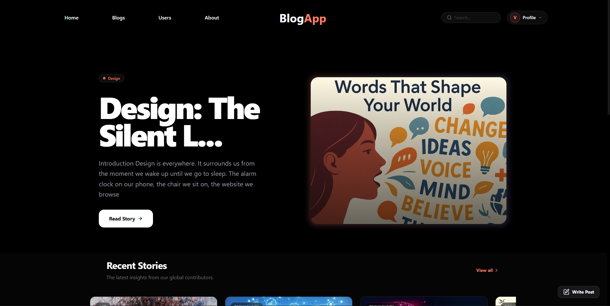
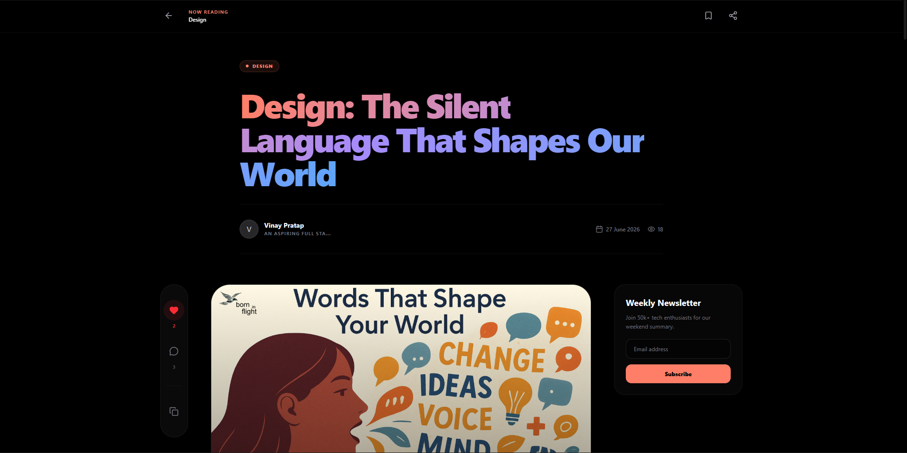
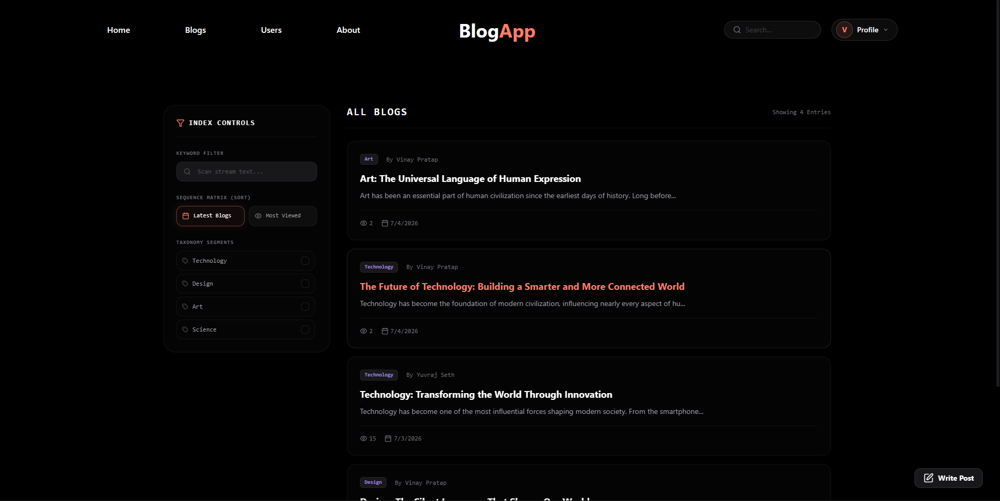
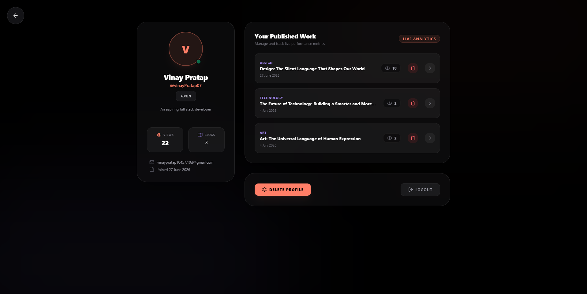
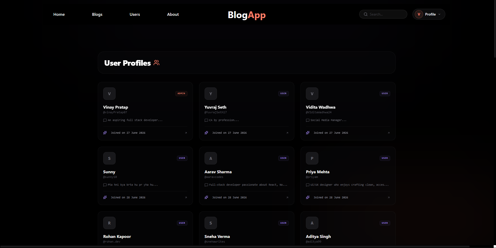
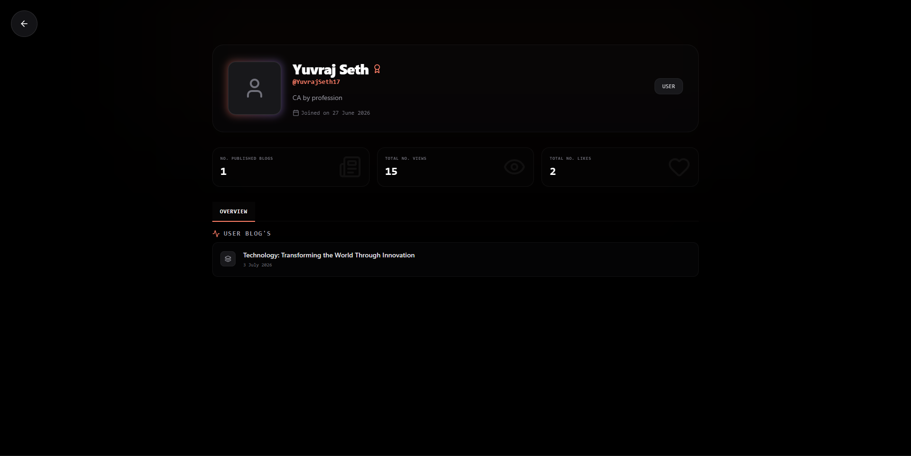

# Blog Platform

A full-stack blog platform built with the MERN stack and TypeScript. Users can create, read, update, and interact with blog posts through a responsive web interface.

## 🚀 Features

- User authentication with JWT
- Cookie-based authentication
- Create, and delete blog posts
- View individual blog posts
- Like and unlike blog posts
- Comments and interactions
- Responsive UI
- Protected routes
- Image uploads
- Server-side API architecture
- Client-side data fetching and caching with TanStack Query

## 🛠️ Tech Stack

### Frontend

- React
- TypeScript
- React Router
- Redux Toolkit
- TanStack Query
- Axios
- Tailwind CSS
- Vite

### Backend

- Node.js
- Express.js
- MongoDB
- Mongoose
- JWT
- Cloudinary
- Cookie-based authentication

---

## 📁 Project Structure

```text
BlogApplication/
│
├── client/
│   ├── src/
│   │   ├── API/
│   │   ├── Components/
│   │   ├── Slices/
│   │   ├── Store/
│   │   └── ...
│   └── package.json
│
├── server/
│   ├── Controllers/
│   ├── Models/
│   ├── Routes/
│   ├── Middleware/
│   ├── Services/
│   ├── Utils/
│   └── ...
│
├── screenshots/
│   ├── home.png
│   ├── blog.png
│   ├── create-blog.png
│   ├── dashboard.png
│   └── login.png
│
└── README.md
```

---

# 📸 Screenshots

## Home Page



## Blog Page



## Search/Filter Blog



## User Profile



## Search other users



## Explore other users profile



---

# 🔐 Authentication

The application uses JWT-based authentication with HTTP cookies.

```text
User Login
     ↓
Backend validates credentials
     ↓
JWT generated
     ↓
JWT stored in HTTP cookie
     ↓
Browser sends cookie with requests
     ↓
Authentication middleware validates JWT
     ↓
Protected resource accessed
```

Using cookies allows the browser to automatically send the authentication cookie with requests.

---

# 🔄 Application Flow

### Reading a Blog

```text
React Component
      ↓
TanStack Query
      ↓
Axios
      ↓
Express Route
      ↓
Controller
      ↓
Database Logic
      ↓
MongoDB
      ↓
API Response
      ↓
React UI
```

### Creating a Blog

```text
User
 ↓
Create Blog Form
 ↓
React
 ↓
Axios POST Request
 ↓
Express Route
 ↓
Authentication Middleware
 ↓
Controller
 ↓
MongoDB
 ↓
Response
 ↓
TanStack Query Cache
 ↓
UI
```

---

# ❤️ Blog Likes

Users can like and unlike blog posts.

```http
POST /:id/likes
```

Adds a like to the blog.

```http
DELETE /:id/likes
```

Removes the user's like.

The frontend determines the current user's like state and displays the appropriate action.

---

# 📜 API Overview

## Authentication

fixed route before all user end point: "/api/user"

| Method | Endpoint    | Description      |
| ------ | ----------- | ---------------- |
| POST   | `/register` | Register a user  |
| POST   | `/login`    | Login            |
| POST   | `/logout`   | Logout           |
| GET    | `/me`       | Get current user |

## Blogs

fixed route before all blog end point: "/api/blog"

| Method | Endpoint | Description       |
| ------ | -------- | ----------------- |
| GET    | `/`      | Get blogs         |
| GET    | `/:id`   | Get a single blog |
| POST   | `/`      | Create a blog     |
| DELETE | `/:id`   | Delete a blog     |

## Likes

| Method | Endpoint     | Description   |
| ------ | ------------ | ------------- |
| POST   | `/:id/likes` | Like a blog   |
| DELETE | `/:id/likes` | Unlike a blog |

---

# ⚙️ Installation

## 1. Clone the repository

```bash
git clone https://github.com/VinayPratap07/Blog_App
cd Blog_App
```

## 2. Install frontend dependencies

```bash
cd blog-web
npm install
```

## 3. Install backend dependencies

```bash
cd ../blog-api
npm install
```

## 4. Configure environment variables

Create a `.env` file in the backend directory.

```env
PORT=5000
MONGO_URI=your_mongodb_connection_string
JWT_SECRET=your_jwt_secret
CLOUDINARY_CLOUD_NAME=your_cloudinary_name
CLOUDINARY_API_KEY=your_cloudinary_key
CLOUDINARY_API_SECRET=your_cloudinary_secret
```

Configure the frontend environment variables as required by the application.

---

# ▶️ Running the Project

### Start the backend

```bash
cd blog-api
npm start
```

### Start the frontend

```bash
cd blog-web
npm run dev
```

The frontend will be available through the Vite development server.

---

# 🧠 Key Engineering Concepts

This project was built to practice and implement real-world full-stack development concepts:

- REST API design
- Authentication and authorization
- JWT and HTTP cookies
- MongoDB data modeling
- Mongoose relationships
- React component architecture
- State management with Redux Toolkit
- Server-state management with TanStack Query
- API communication with Axios
- Protected routes
- Optimistic UI interactions
- Image uploading
- Responsive design
- Error and loading states
- Frontend/backend separation

---

# 🔮 Future Improvements

- Rich text editor for blog creation
- Markdown support
- Categories and tags
- Follow system
- Notifications
- Bookmarking
- Better recommendation system
- Pagination optimization
- Automated testing
- CI/CD pipeline

---

# 👨‍💻 Author

**Vinay Pratap**

Full-Stack Web Developer | MERN Stack

---

## 📄 License

This project is intended for learning and portfolio purposes.
